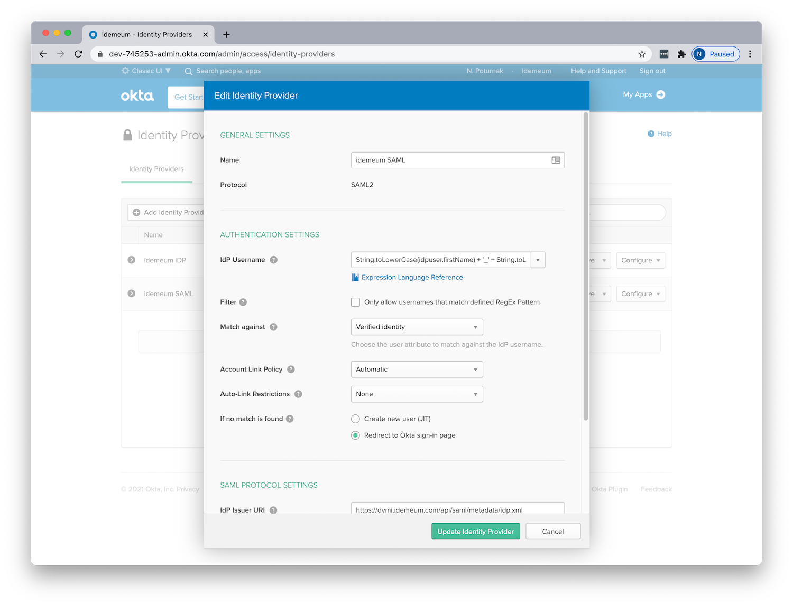
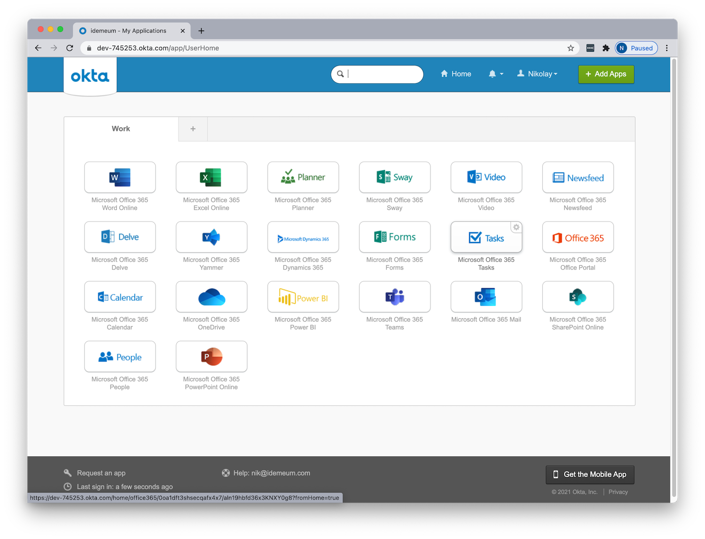

# Integrate idemeum with Okta

<style>.embed-container { position: relative; padding-bottom: 56.25%; height: 0; overflow: hidden; max-width: 100%; } .embed-container iframe, .embed-container object, .embed-container embed { position: absolute; top: 0; left: 0; width: 100%; height: 100%; }</style><div class='embed-container'><iframe src='https://www.youtube.com/embed/6_zlInkDaSU?rel=0&modestbranding=1&autohide=1' frameborder='0' allowfullscreen></iframe></div>


## How can idemeum help secure Okta deployments?

idemeum integrates with [Okta](https://www.okta.com/) directly over SAML and provides the following services:

| Service | Description |
| ------- | ----------- |
| [**Passwordless MFA**](https://idemeum.com/mfa) | Eliminate passwords when users access your SSO applications. No enrollment, no user sync, easy and simple.|
| [**Verified log in**](https://idemeum.com/blog/idemeum-verification) | idemeum has built in document verification. When integrated with Okta, idemeum can log in users not just using their email address, but also verified first name and last name, whereby making every login trusted and verified and reducing identity fraud. |

## How does the integration work?

idemeum integrates with Okta in minutes. As idemeum is decentralized, there is no need to synchronize users to idemeum from Active Directory, or deploy any additional servers and connectors. Simply federate your Okta tenant with idemeum over SAML protocol.


In the diagram above, we see the deployment where Okta is deployed as a primary IDP and all applications are federated directly with Okta. When user is trying to authenticate to any corporate application, the sign in request is sent first to Okta, and is then subsequently redirected to idemeum. idemeum performs Passwordless Multi-Factor authentication and returns necessary user information to Okta, which in turn forwards that user information to federated application. As a result users can access application without any passwords.

!!! info "idemeum differentiation"
    The key difference to note here is that you can configure idemeum to release not just email, but also first name and last name for employee. When all these claims are processed for authentication, the match is done not just with email but with verified ID document information. Therefore, every login becomes trusted.

## Integrate idemeum with Okta

We are going to go through simple four steps to integrate idemeum with your Okta identity environment.

1. Request idemeum tenant
2. Set up verified login (optional)
3. Configure Okta for federation
4. Test user sign-in

### 1. 🤝 Request idemeum tenant
👉 As a first step, reach out to idemeum team at **[support@idemeum.com](mailto:support@idemeum.com)** with the request to provision idemeum tenant.

Please, let us know that you will be integrating idemeum with Okta and whether you want to use verified login or not.

We will need several things from you:

1. **Preferred tenant name** - we will provision a tenant name for you based on your preferences. The tenant name will be in the form of `<your company>.idemeum.com`.

2. **Company logo** - share your company logo with us so that we can display it on every login page request as well as in the application, when users log into your company resources. We will need the image in the `png` or `jpeg` format.

3. **Okta SAML IDP metadata** -  we will need your Okta IDP metadata file, so that we can configure SAML trust on our end.


As a result, we will share the following with you:

* **IDP issuer URI** - you will need this URI to configure Okta federation with idemeum. This URI can always be extracted from your idemeum SAML metadata file.
* **IdP Single Sign-On URL** - you will need this URI to configure Okta federation with idemeum. This is the URL where Okta will send SAML requests to.
* **IdP Signature Certificate** - you will need this certificate to establish secure trust between Okta and idemeum.

!!! tip "Tip"
    When we provision idemeum tenant for you, your tenant's metadata XML file will be accessible using this link `https://<your tenant name>/api/saml/metadata/idp.xml`. All configuration parameters listed above can be extracted from this SAML metadata file.

### 2. ✔️ Set up verified login

This step is optional. You can login your users and match the account using only email address. This is what most of the commercial identity solutions do today. However, idemeum offers an opportunity to increase identity trust and login your users with not just email, but a combination of **email + firstName + lastName**.

To make it work, we will need to create a custom attribute for Okta users, say **verifiedIdentity** and populate it with a combination of email + firstName + lastName. When idemeum will return verified user claims, Okta will match them against this custom attribute.

In this case we are going to be working with Active Directory users that you are synchronizing to Okta tenant.


1. Login to your Okta tenant with admin account
2. Navigate to `Directory` -> `Profile editor`
  
3. Choose `User(default)` profile, click `Add Attribute` and create custom attribute that you will be using for user matching. In our case we are creating an attribute with the display name `Verified Identity` and variable name `verifiedIdentity`. We are not making this attribute required.
  
4. Now navigate to `Directory` -> `Profile editor` and then choose your Active Directory integration and click `Mappings`. Scroll all the way down to find custom attribute that we created. And now create a custom mapping for this attribute.
  ``` PowerShell
  toLowerCase(appuser.firstName) + '_' + toLowerCase(appuser.lastName) + '_' + toLowerCase(appuser.email)
  ```
  

    !!! info "Info"
        What this means is that when users will be synced from Active Directory, Okta will take a combination of **firstName + lastName + email** and will populate that combination into our custom attribute **verifiedIdentity**.

At this point we have configured everything necessary to perform verified login with claims passed from idemeum. Now we can move to the next step of configuring SAML federation between Okta and idemeum.

!!! tip "Tip"
    At this point you will need to force sync users from Active Directory to make sure custom attributes get populated for all your existing or new users.

### 3. ⚙️ Configure Okta for federation

####Configure 3rd party IDP

1. Navigate to `Security` -> `Identity Providers` -> `Add Identity Provider` -> `Add SAML 2.0 IDP`
  
2. Let's configure the following options.
    * **Name** - assign a name to your IDP, for example `idemeum SAML`
    * **IDP username** - create custom string for this attribute
      ```PowerShell
      String.toLowerCase(idpuser.firstName) + '_' + String.toLowerCase(idpuser.lastName) + '_' + idpuser.email
      ```
    * **Match against** - choose the display name of the custom attribute your created in the previous section.
    * **Account Link Policy** - choose `Automatic`
    * **Account Link Restriction** - choose `None`
    * **If match not found** - choose `Redirect to Okta sign-in page`
    * **IDP issuer URI** - enter the URI that we shared with you. You will always have that available in your idemeum metadata file.
    * **IdP Single Sign-On URL** - enter the URL that we shared with you. You will always have that available in your idemeum metadata file.
    * **IdP Signature Certificate** - enter the certificate that we shared with you. You will always have that available in your idemeum metadata file.
    * **Request Binding** - make sure you have `HTTP POST` selected.

    You can leave other parameters with default settings.

3. Save your identity provider configuration.
4. Return to `Identity Providers` section, expand the details of the identity provider you just created by clicking on the arrow next to IDP name, download metadata file and share with our **[support team](mailto:support@idemeum.com)**. We will need this information to establish trust between your Okta tenant and idemeum.
  

At this point you created identity provider in Okta to federate all authentication requests with idemeum. As a next step you need to apply this identity provider in Okta Routing Rules.


#### Configure routing rule

1. Navigate to `Security` -> `Identity Providers` -> `Routing Rules`. In this case we are going to create a new routing rule for passwordless authentication.
  

    As you can see we are keeping default configuration, but we are using our `idemeum SAML` identity provider for authentication.

    !!! Warning "Warning"
        Once you enable a routing rule, all authentication requests will be redirected to idemeum. If for any reason the idemeum authentication does not work, and you need to log into Okta admin account with username and password, you can always use the backdoor entry that bypasses routing rules. You can access it by using the following link `https://<your Okta tenant>/login/default`

    !!! tip "Tip"
        In this case we enabled idemeum authentication for all users in Okta. If you want to configure a small group of users to try out idemeum, you can always create a special group, put your test users in that group, and assign routing rule only to this group. To do that you can use `User matches` configuration in the routing rule set up.

2. It is also recommended that you customize Sign-Out page when routing rule is enabled with idemeum. To do that, navigate to `Settings` -> `Customization`, and click `Edit` in the `Sign-Out Page` section. Choose `Use a custom sign-out page` and enter any page, for example `https://okta.com`. Click `Save`.
  


### 4. 🧪 Test user sign-in

Once you are done with configuration you can quickly test the user sign-in flow.

1. Open incognito browser window and navigate to your Okta tenant URL. Once you do that you will be redirected to idemeum for login. You will see the QR code that you will need to scan with the idemeum application.
  

2. Once you scan the QR code with idemeum application and approve the sign in, you will be redirected to Okta application catalog.
  

🎉 **Congratulations!** You have successfully integrated idemeum and protected your Okta deployment with passwordless multi-factor authentication.

[^1]: [Create an Identity Provider in Okta](https://developer.okta.com/docs/guides/add-an-external-idp/saml2/configure-idp-in-okta/)
[^2]: [Identity Providers in Okta](https://help.okta.com/en/prod/Content/Topics/Security/Identity_Providers.htm)
[^3]: [Configure routing rules in Okta](https://help.okta.com/en/prod/Content/Topics/Security/configure-routing-rules.htm)
