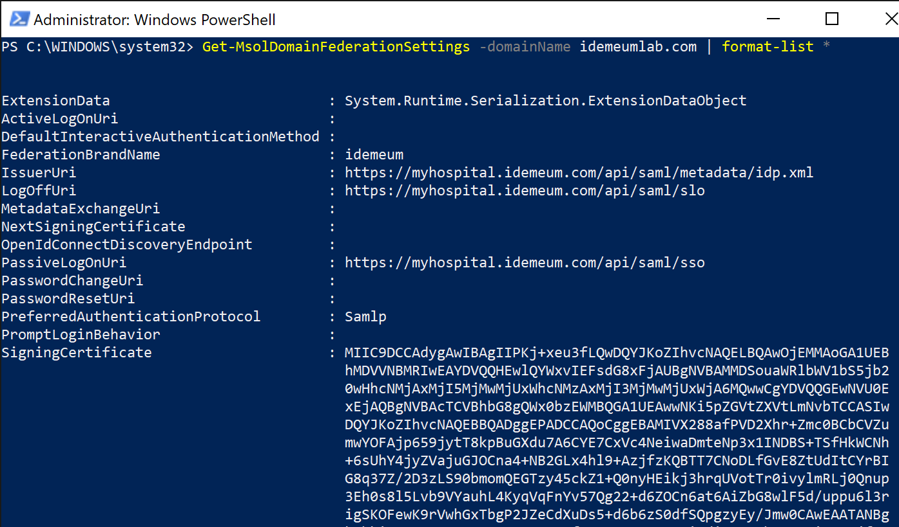

# :fontawesome-brands-microsoft: Integrate idemeum with Azure AD (B2B)

## How can idemeum help secure O365?

idemeum integrates with [Azure Active Directory (AAD)](https://azure.microsoft.com/en-us/services/active-directory/) directly over SAML and provides the following services:

| Service | Description |
| ------- | ----------- |
| [**Passwordless MFA**](https://idemeum.com/mfa) | Eliminate passwords when users access your SSO and O365 resources. No enrollment, no user sync, easy and simple. idemeum supports cloud-only as well as hybrid deployment models. | 

## How is O365 deployed?

O365 and Azure Active Directory (AAD) can be implemented with various [deployment models](https://docs.microsoft.com/en-us/microsoft-365/enterprise/about-microsoft-365-identity?view=o365-worldwide).

| Deployment model | Definition |
| ----------- | ------------------------------------ |
| **Cloud only identity** | User account only exists in the Azure AD tenant for your Microsoft 365 subscription.  |
| **Hybrid identity** | User account exists in AD DS and a copy is also in the Azure AD tenant for your Microsoft 365 subscription. The user account in Azure AD might also include a hashed version of the already hashed AD DS user account password. <br><br> For authentication there are several options: [password hash synchronization](https://docs.microsoft.com/en-us/azure/active-directory/hybrid/whatis-phs), [pass-through authentication](https://docs.microsoft.com/en-us/azure/active-directory/hybrid/how-to-connect-pta), and [federation with ADFS](https://docs.microsoft.com/en-us/azure/active-directory/hybrid/whatis-fed).|


## How is idemeum integrated with O365?

idemeum can be federated directly with AAD using SAML protocol. When federating directly with Azure AD, idemeum can support **cloud only** as well as **hybrid (password sync and pass-through)** models.


## Intergate idemeum with Azure AD

We are going to go through simple three steps to integrate idemeum with your Microsoft identity environment.

1. Request idemeum tenant
2. Configure Azure AD for federation
2. Test user sign-in

All additional Microsoft documentation and useful links can be found in [footnotes](#fn:1).

### ⚙️ 1. Request idemeum tenant

As a first step, reach out to idemeum team at `support@idemeum.com` with the request to provision idemeum tenant. We will need two things from you:

1. **Preferred tenant name** - we will provision a tenant name for you based on you preferences. The tenant name will be in the form of:

    !!! tip "Tenant name"
        `<your company>.idemeum.com`

2. **Company logo** - share your company logo with us so that we can display it on every login page request as well as in the application, when users log into your company resources. We will need the image in the `png` or `jpeg` format.

As a result of tenant provisioning we will share the configuration details with you, so that you can later use them in your Azure AD configuration:

* `$LogOnUrl` - SAML LogOn URL.
* `$LogOffUrl` - SAML LogOff URL.
* `$SigningCert` - signing certificate to establish federation trust.
* `$IssuerUri` - URI to identify idemeum in SAML responses.

### 🧑🏿‍🤝‍🧑🏼 2. Configure Azure AD for federation

After signing up for Office 365, the only domain associated with your account is the `onmicrosoft.com` subdomain chosen during registration (for example, `contoso.onmicrosoft.com`). To allow users to SSO to Azure AD and Office 365, it is **recommended** to have another domain added to the environment. If you already have such domain added and verified, you can always use that.

!!! warning "Make sure you have admin account with another domain"
    Once you configure Azure AD domain to be federated, you will no longer be able to use local login into accounts associated with that domain. Therefore, if something is wrong with the configuration, you might lock yourself out. To prevent that, make sure you have admin account created on other domain (for instance on your `onmicrosoft.com` domain), so that you can always use that account to log in and revert federation configuration.

We will be using PowerShell to configure the Azure AD domain for federation[^1].

1. Launch PowerShell on a Windows machine
2. Install [MSOnline PowerShell module](https://docs.microsoft.com/en-us/powershell/module/msonline/?view=azureadps-1.0) if you have not already
  ``` PowerShell
  Install-Module MSOnline
  ```
3. Connect to MSOnline service. You will need to authenticate with your Azure AD Portal admin credentials
  ``` PowerShell
  Connect-MsolService
  ```
4. You can check your existing domains and their federation settings
  ``` PowerShell
  Get-MsolDomain
  ```
  
5. Check your current domain federation settings. If the current setting is `federated`, you will need to first convert domain to `managed' setting
  ``` PowerShell
  Get-MsolDomainFederationSettings
  ```
  
  ``` PowerShell
  Set-MsolDomainAuthentication -DomainName <yourdomain> -Authentication managed
  ```
6. Now you can configure your domain with federation settings. Take a look at the example below.
    * `$Domain` - the domain that you are planning to federate with idemeum
    * `$BrandName` - the name that you will use for federation
    * `$LogOnUrl` - this is a SAML LogOn URL. We will share this URL with you as part of onboarding.
    * `$LogOffUrl` - this is a SAML LogOff URL. We will share this URL with you as part of onboarding
    * `$SigningCert` - signing certificate to establish federation trust. We will share this certificate with you as part of onboarding.
    * `$IssuerUri` - URI that identifies idemeum as SAML issuer.
    * `$Protocol` - protocol to use for federation. In our case it is SAML
  ``` PowerShell
  $Domain="idemeumlab.com"
  $BrandName="idemeum"
  $LogOnUrl="https://myhospital.idemeum.com/api/saml/sso"
  $LogOffUrl="https://myhospital.idemeum.com/api/saml/slo"
  $SigningCert="MIIC9DCCAdygAwIBAgIIPKj+xeu3fLQwDQYJKoZIhvcNAQELBQAwOjEMMAoGA1UEBhMDVVNBMRIwEAYDVQQHEwlQYWxvIEFsdG8xFjAUBgNVBAMMDSouaWRlbWV1bS5jb20wHhcNMjAxMjI5MjMwMjUxWhcNMzAxMjI3MjMwMjUxWjA6MQwwCgYDVQQGEwNVU0ExEjAQBgNVBAcTCVBhbG8gQWx0bzEWMBQGA1UEAwwNKi5pZGVtZXVtLmNvbTCCASIwDQYJKoZIhvcNAQEBBQADggEPADCCAQoCggEBAMIVX288afPVD2Xhr+Zmc0BCbCVZumwYOFAjp659jytT8kpBuGXdu7A6CYE7CxVc4NeiwaDmteNp3x1INDBS+TSfHkWCNh+6sUhY4jyZVajuGJOCna4+NB2GLx4hl9+AzjfzKQBTT7CNoDLfGvE8ZtUdItCYrBIG8q37Z/2D3zLS90bmomQEGTzy45ckZ1+Q0nyHEikj3hrqUVotTr0ivylmRLj0Qnup3Eh0s8l5Lvb9VYauhL4KyqVqFnYv57Qg22+d6ZOCn6at6AiZbG8wlF5d/uppu6l3rigSKOFewK9rVwhGxTbgP2JZeCdXuDs5+d6b6zS0dfSQpgzyEy/Jmw0CAwEAATANBgkqhkiG9w0BAQsFAAOCAQEAWVG0ufqrF9oBYCBzm68i2di2IuEMhF2gW5ixcVgjfLLpnFrT0Lkt4taF+32ykNU9kram/SjSHF2+hJoBZ4BBQYIMXyA9TFn1bcn7LOq8uiDS/cF9noHlYrxOboq0qc38R4wkjSOEOFhs98zhRz2IPUccvwgfoiQZS3lt12Gb8KcZPaGKVnoxunpe7mQj69WkiKgBJLR2G4ODIX+FY01zwz7coplqYMOohTgOV/ej1BloWVWHFTkXKDtIgeuyQWGnJ3gBjDzmB5XwxvxA0NNCZVzhO23S0z/rn8eqKQ6obkabZUILurOeBC4wKEH314sbtOIP0NTI+Xc5LpbOwonhVQ=="
  $IssuerUri="https://myhospital.idemeum.com/api/saml/metadata/idp.xml"
  $Protocol="SAMLP"

  Set-MsolDomainAuthentication -DomainName $Domain -FederationBrandName $BrandName -Authentication federated -PassiveLogOnUri  $LogOnUrl -SigningCertificate $SigningCert -IssuerUri $IssuerUri -LogOffUri $LogOffUrl -PreferredAuthenticationProtocol $Protocol
  ```
7. Verify that the settings are successfully configured for your domain.
  ``` PowerShell
  Get-MsolDomainFederationSettings -DomainName <your domain here> | format-list *
  ```
  

### 🧪 3. Test user sign in

Once you are done with configuration you can quickly test the user sign-in flow.

1. Open incognito browser window and navigate to [`portal.office.com`](https://portal.office.com)
  
2. Enter the email address of the account that you would like to sign into. Once you do that you will be redirected to idemeum for login. You will see the QR code that you will need to scan with the idemeum application.
    
3. Once you scan the QR code with idemeum application and approve the sign in, you will be redirected to office 365.
  

[^1]: [Microsoft documentation - Configure SAML federation provider](https://docs.microsoft.com/en-us/azure/active-directory/hybrid/how-to-connect-fed-saml-idp)
[^2]: [Azure AD SAML metadata](https://nexus.microsoftonline-p.com/federationmetadata/saml20/federationmetadata.xml)
[^3]: [MSOnline reference documentation](https://docs.microsoft.com/en-us/powershell/module/msonline/?view=azureadps-1.0)
[^4]: [Contact idemeum for any support questions](https://idemeum.com/contact)

🎉 Congratulations! You have successfully integrated idemeum and protected your O365 deployment with passwordless authentication.
