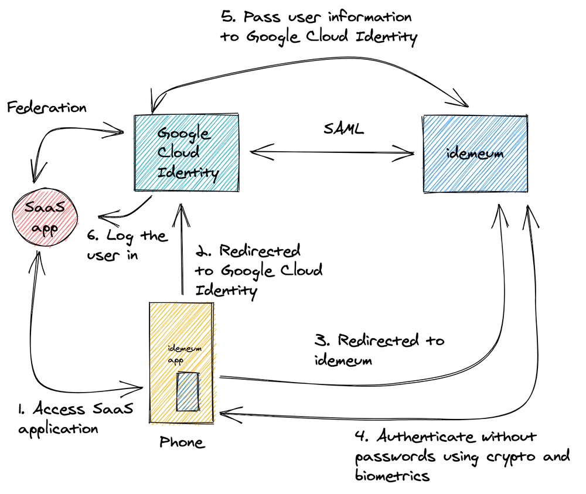
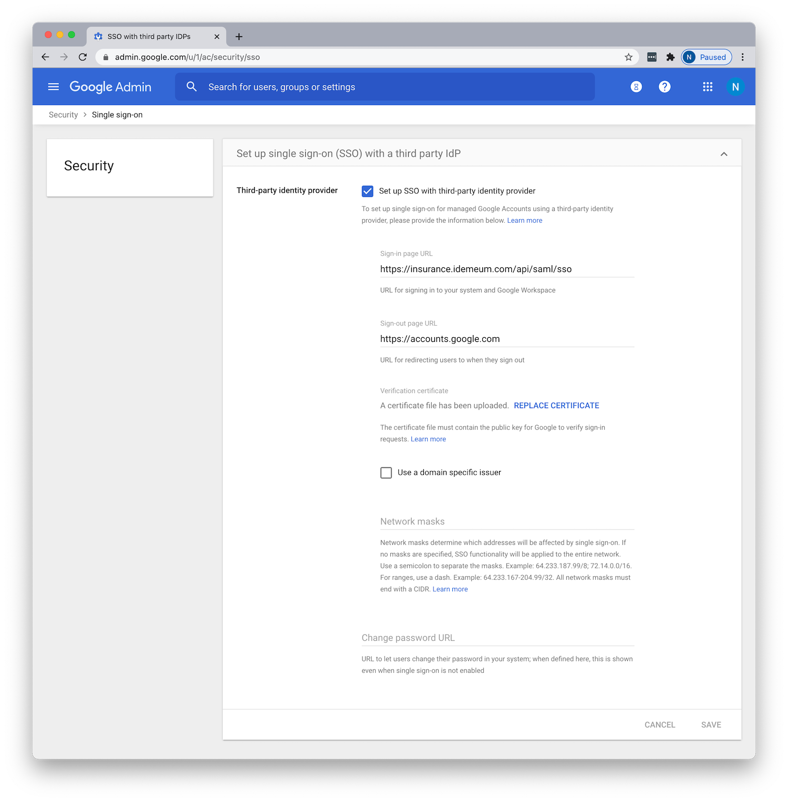
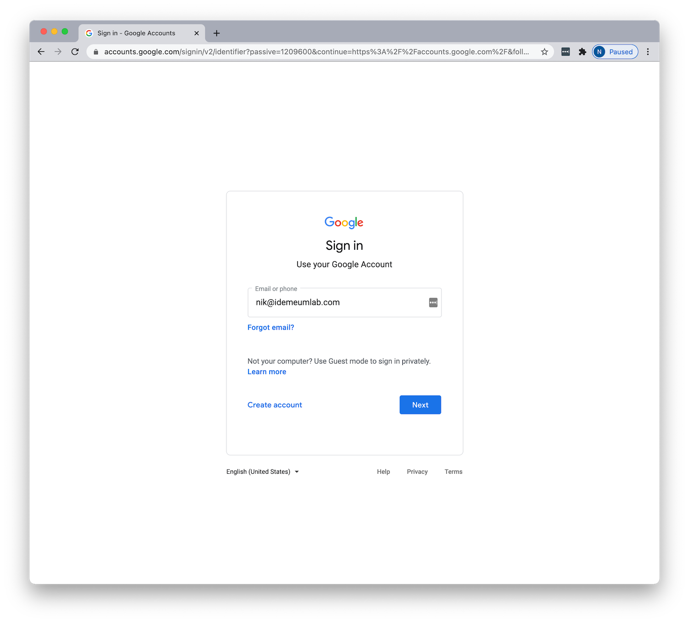
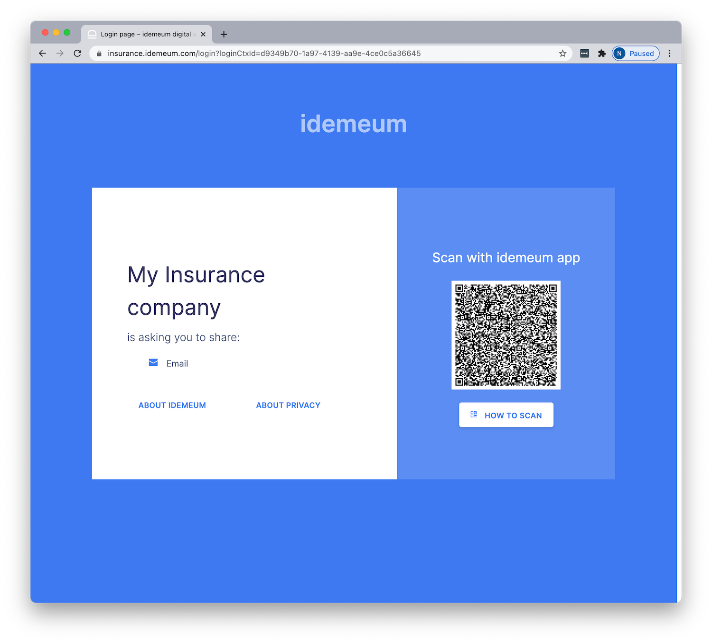
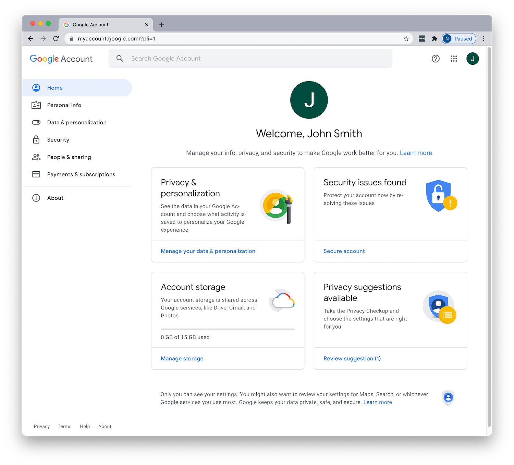

# :fontawesome-brands-google: Integrate idemeum with Google workspace

<iframe src='https://www.youtube.com/embed/dYK3jojNQXg?rel=0&modestbranding=1&autohide=1' frameborder='0' allowfullscreen></iframe>

## How can idemeum help secure Google Workspace deployments?

idemeum integrates with [Google Cloud Identity](https://cloud.google.com/identity) directly over SAML and provides the following services:

| Service | Description |
| ------- | ----------- |
| [**Passwordless MFA**](https://idemeum.com/mfa) | Eliminate passwords when users access your SSO applications. No enrollment, no user sync, easy and simple.|

## How does the integration work?

idemeum integrates with Google Cloud Identity in minutes. As idemeum is decentralized, there is no need to synchronize users to idemeum from Active or LDAP directory, or deploy any additional servers and connectors. Simply federate your Google Cloud Identity tenant with idemeum over SAML protocol.

👨‍💻 In the diagram above, we see the deployment where **Google Cloud Identity** is deployed as a primary IDP and all applications are federated directly with it. When user is trying to authenticate to any corporate application or Google Workspace, the sign in request is sent first to Google Cloud Identity, and is then subsequently redirected to idemeum. idemeum performs Passwordless Multi-Factor authentication and returns necessary user information to Google Cloud Identity, which in turn forwards that user information to federated application. As a result users can access application without any passwords.

## Integrate idemeum with Google Cloud Identity

We are going to go through simple three steps to integrate idemeum with your Google Workspace environment.

1. Request idemeum tenant
2. Configure Google Cloud Identity for federation
3. Test user sign-in

### 1. 🤝 Request idemeum tenant
👉 As a first step, reach out to idemeum team at **[support@idemeum.com](mailto:support@idemeum.com)** with the request to provision idemeum tenant.

Please, let us know that you will be integrating idemeum with Google Workspace.

We will need several things from you:

1. **Preferred tenant name** - we will provision a tenant name for you based on your preferences. The tenant name will be in the form of `<your company>.idemeum.com`.

2. **Company logo** - share your company logo with us so that we can display it on every login page request as well as in the application, when users log into your company resources. We will need the image in the `png` or `jpeg` format.

As a result, we will share the following with you:

* **IdP Single Sign-On URL** - you will need this URI to configure Google Cloud Identity federation with idemeum. This is the URL where Google Cloud Identity will send SAML requests to.
* **IdP Signature Certificate** - you will need this certificate to establish secure trust between Google Cloud Identity and idemeum.

!!! tip "Tip"
    When we provision idemeum tenant for you, your tenant's metadata XML file will be accessible using this link `https://<your tenant name>/api/saml/metadata/idp.xml`. All configuration parameters listed above can be extracted from this SAML metadata file.

### 2. ⚙️ Configure Google Cloud Identity for federation

1. Sign in to your Google Workspace Admin portal
2. Navigate to `Security`, scroll down and find the section `Set up single sign-on (SSO) with a third party IdP`. Click on that section to set up idemeum as 3rd party IDP.
  
3. Configure the following settings:
    * **Set up SSO with third-party identity provider** - enable checkbox
    * **Sign-in page URL** - enter the URL that we shared with you after tenant creation. You can always get that data from your idemeum SAML XML file.
    * **Sign-out page URL** - enter `https://accounts.google.com`
    * **Verification certificate** - upload the certificate that we shared with you. You can always get that data from your idemeum SAML XML file.
    * Leave other fields blank.
    * Click `Save`

At this point you configured idemeum to become 3rd party IDP for Google Cloud Identity, and all authentication requests for your domain will be redirected to idemeum.

!!! info "Note"
    Authentication for admin console with Admin credentials is still handled by Google Cloud identity. All you need to do it to navigate to `https://admin.google.com/u/0/ac/home` and login with your admin credentials. Please refer to documentation [here](https://support.google.com/a/answer/6341409?hl=en&ref_topic=7556907).

### 3. 🧪 Test user sign-in

Once you are done with configuration you can quickly test the user sign-in flow.

1. Open incognito browser window and navigate to your **[accounts.google.com/](https://accounts.google.com/)**.
  

2. Enter your email address with you domain, and you will be redirected to idemeum for sign in. You will need to scan QR code with idemeum app.
  

3. Once you scan the QR code with idemeum application and approve the sign in, you will be redirected to Google Workspace application catalog.
  

🎉 **Congratulations!** You have successfully integrated idemeum and protected your Google Workspace deployment with passwordless multi-factor authentication.

[^1]: [Set up SSO via a third party Identity provider](https://support.google.com/a/answer/60224?hl=en&ref_topic=7556907&visit_id=637466828028738286-4181606564&rd=1)
[^2]: [Understanding SAML secure sign-in](https://support.google.com/a/answer/9225455?hl=en&ref_topic=7579248)
[^3]: [SSO assertion requirements](https://support.google.com/a/answer/9225455?hl=en&ref_topic=7579248)
