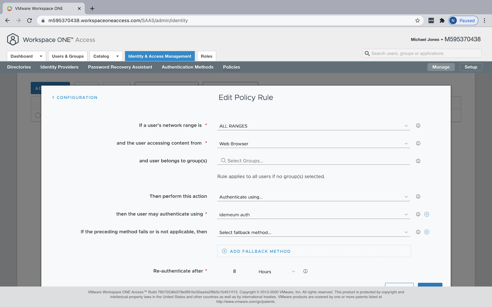
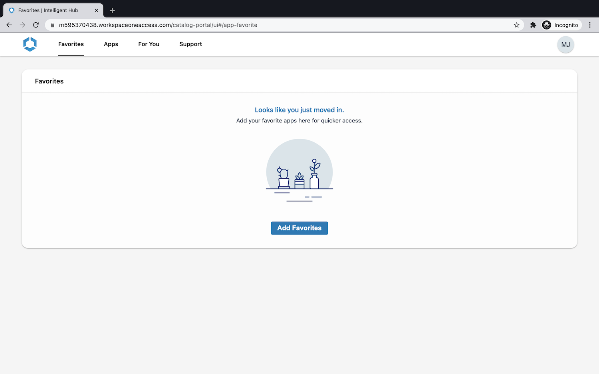

# Integrate idemeum with VMware WS1 Access

<iframe src='https://www.youtube.com/embed/nOstEQr2c9U?rel=0&modestbranding=1&autohide=1' frameborder='0' allowfullscreen></iframe>

## How can idemeum help secure Workspace ONE deployments?

idemeum integrates with [Workspace ONE Access](https://www.vmware.com/products/workspace-one/access.html) directly over SAML and provides the following services:

| Service | Description |
| ------- | ----------- |
| [**Passwordless MFA**](https://idemeum.com/mfa) | Eliminate passwords when users access your SSO applications. No enrollment, no user sync, easy and simple.|

## How does the integration work?

idemeum integrates with Workspace ONE in minutes. As idemeum is decentralized, there is no need to synchronize users to idemeum from Active Directory, or deploy any additional servers and connectors. Simply federate your Workspace ONE appliance or SaaS tenant with idemeum over SAML protocol.

Workspace ONE Access can be your primary Identity Provider or a broker. idemeum can integrate either directly with your primary identity provider, or it can integrate with Access when it is deployed as a broker.

In the diagram above, we can see the deployment where WS1 Access is deployed as a primary IDP and all applications are federated directly with WS1 Access. When user is trying to authenticate to any corporate application, the sign in request is sent first to WS1 Access, and is then subsequently redirected to idemeum. idemeum performs Passwordless Multi-Factor authentication and returns necessary user information to Access, which in turn forwards that user information to federated application. As a result users can access application without any passwords.

## Integrate idemeum with Workspace ONE Access

We are going to go through simple three steps to integrate idemeum with your WS1 Access identity environment.

1. Request idemeum tenant
2. Configure WS1 Access for federation
2. Test user sign-in

### 1. Request idemeum tenant

As a first step, reach out to idemeum team at [support@idemeum.com](mailto:support@idemeum.com) with the request to provision idemeum tenant. Please, let us know that you will be integrating idemeum with Workspace ONE Access.

We will need two things from you:

1. **Preferred tenant name** - we will provision a tenant name for you based on your preferences. The tenant name will be in the form of `<your company>.idemeum.com`.

2. **Company logo** - share your company logo with us so that we can display it on every login page request as well as in the application, when users log into your company resources. We will need the image in the `png` or `jpeg` format.

3. **WS1 Access tenant name** -  we will need your WS1 Access tenant name so that we can have access to your IDP metadata file, so that we can configure SAML trust on our end.

As a result of tenant provisioning we will share the SAML XML metadata file URL with you that you will need to use to set up federation with WS1 Access.

!!! tip "Tip"
    Metadata XML fill link will have the following format `https://<your tenant name>/api/saml/metadata/idp.xml`.

### 2. Configure Workspace ONE Access for federation

#### Set idemeum as 3rd party IDP

1. Login in to your Workspace ONE Access Tenant as an admin.
  

2. Navigate to `Identity & Access Management` -> `Identity Providers`.
  

3. Click `Add Identity Provider` -> `Create SAML IDP`.
  

4. Add the name of your identity provider. For instance `idemeum`.
5. Paste the metadata URL that you got from us when we provisioned idemeum tenant for you.

    !!! tip "Tip"
        Metadata XML fill link will have the following format `https://<your tenant name>/api/saml/metadata/idp.xml`.

6. Once the SAML metadata is processed, make sure you adjust `Binding Protocol` to `HTTP POST`.
  

7. Make sure `Name ID Policy in SAML Request` is defined as `Unspecified`.
8. Choose `ALL RANGES` in `Network` section.
9. Create one authentication method for your IDP. In the `Authentication Methods` section, create name for your method and choose `PasswordProtectedTransport` for SAML context input field.
  
10. Click `Add` to save IDP configuration.

#### Apply idemeum IDP in policy configuration

At this point you have configured idemeum as 3rd party identity provider for WS1 Access. What that means is that WS1 Access can now be redirecting authentication requests to idemeum using SAML protocol. What we have to do now is to apply this configuration in WS1 Access policies so that idemeum is actually used for authentication.

1. Navigate to `Identity & Access Management` -> `Policies`.
  

2. You might have different policies depending on your configuration. In this case we will be leveraging default policy set to apply idemeum configuration. We click `default_access_policy_set`, then click `Edit`.
  

3. Navigate to `Configuration` section, and edit the rule that has `Web Browser` device type. This rule will be catching all authentication requests including desktop and mobile. For this rule choose `Authenticate using`, then select the authentication method that you created when you defined idemeum Identity Provider in the previous section. In our case that is `idemeum auth`.
  

    !!! tip "Tip"
        You can always create a fallback rule, in case your employees are still using passwords. In that case when idemeum authentication fails for any reason, WS1 Access will fall back to using passwords to authenticate your employees. Moreover, you can create more specific authentication policy rules for iOS and Android and place them above `Web Browser` rule that you created. You would do that if you want to authenticate requests coming from mobile devices in a different way. But note, that idemeum supports authentication from both Mobile and Desktop, therefore going with default configuration will get you covered.

### 3. Test user sign in

Once you are done with configuration you can quickly test the user sign-in flow.

1. Open incognito browser window and navigate to your WS1 Access tenant URL. Once you do that you will be redirected to idemeum for login. You will see the QR code that you will need to scan with the idemeum application.
  

2. Once you scan the QR code with idemeum application and approve the sign in, you will be redirected to WS1 Access application catalog.
  

🎉 Congratulations! You have successfully integrated idemeum and protected your Workspace ONE deployment with passwordless multi-factor authentication.

[^1]: [WS1 Access VMWare page](https://www.vmware.com/products/workspace-one/access.html)
[^2]: [Configure 3rd party IDP for WS1 Access](https://docs.vmware.com/en/VMware-Workspace-ONE-Access/3.3/idm-administrator/GUID-0C459D5A-A0FF-4893-87A0-10ADDC4E1B8D.html)
